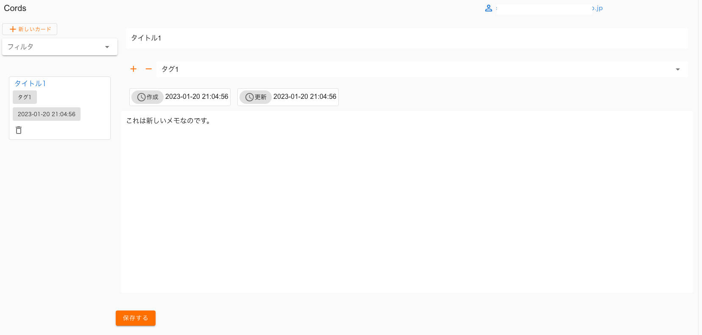

# cords

nuxt.js のおべんきょう。

## Feature

多くない。

- メモ書きを残せる
- メモにはタグがつけられる
- 見出しはなくても保存できる
- フォームは目に優しい `consolas` 。

メモは揮発性（永続化は対応していない）。



## 開発

### 環境構築

`yarn` が必要なので事前にインストールしておく。

```bash
$yarn dev
```
